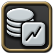
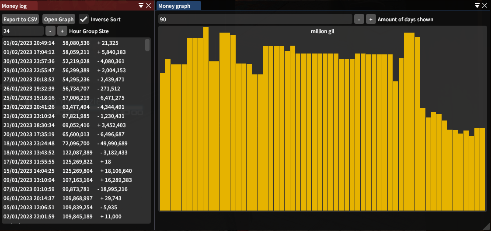

# XIV Money Tracker 
A tool to track your money earned and spent in ffxiv.

## Warning!
I initially created this plugin for personal use, because I wanted to know my profits and expenses while crafting and gathering in ffxiv. It never was intended as a public plugin, so don't _**expect**_ any help or assistance if something doesn't work. But since quite a few people have since found their way to this plugin somehow, I figured I might as well write a readme.

## Installation guide
* **Be sure that "Enable in-game features" is on in the launcher settings to access in-game commands and features!**
* Access Dalamud's settings by typing `/xlsettings` in the chat window and pressing enter.
* Click on the "Experimental" tab.
* Copy and Paste in the following URL into one of the blank inputs under the "Custom Plugin Repositories" section: `https://raw.githubusercontent.com/yschuurmans/MyDalamudPlugins/master/pluginmaster.json`
* Click the "+" button to add it to the list.
* Check the "Enabled" box for your new entry.
* Click "Save and Close" at the bottom.
* Open Dalamud's plugin menu by typing `/xlplugins` in the chat window and pressing enter.
* Look for the "Money Tracker" plugin, and click on install.
